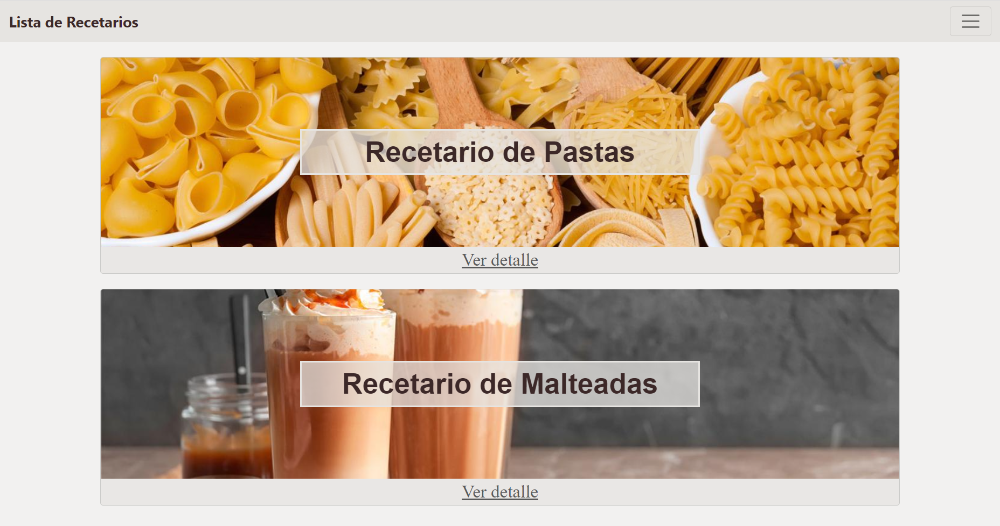
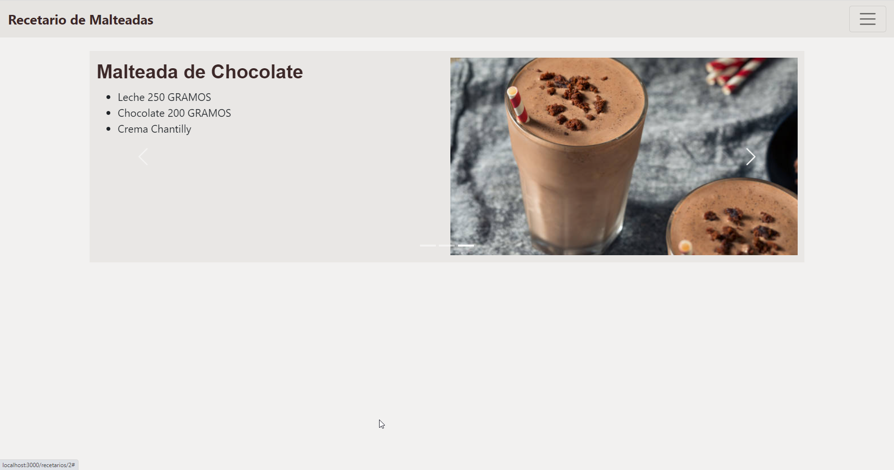

# Gourmet - Miguel Acosta

## Requerimientos
- Para el back: Java, Maven, Spring
- Para el front: Node.js, yarn
- npm install en la carpeta de front

## Para ejecutar
- En el back ejecutar la clase principal
- En el front yarn install y luego yarn start
